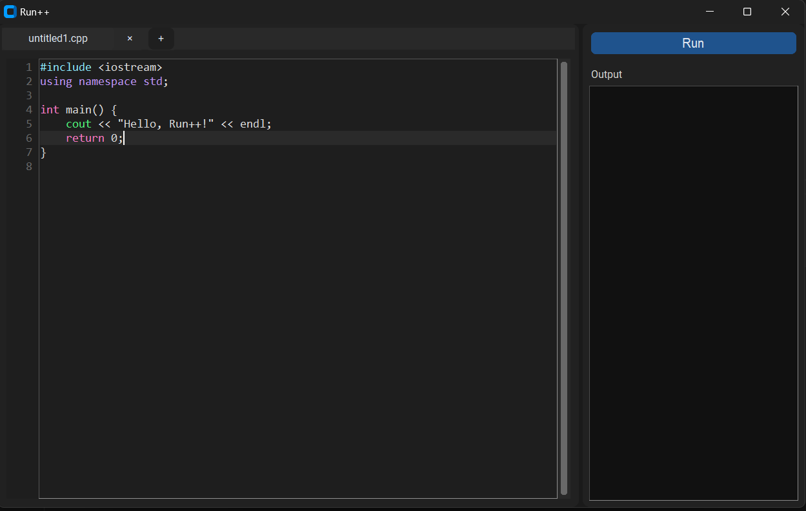
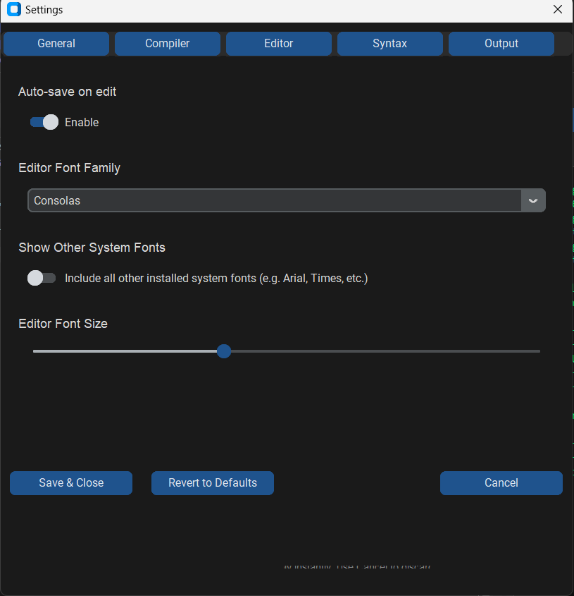
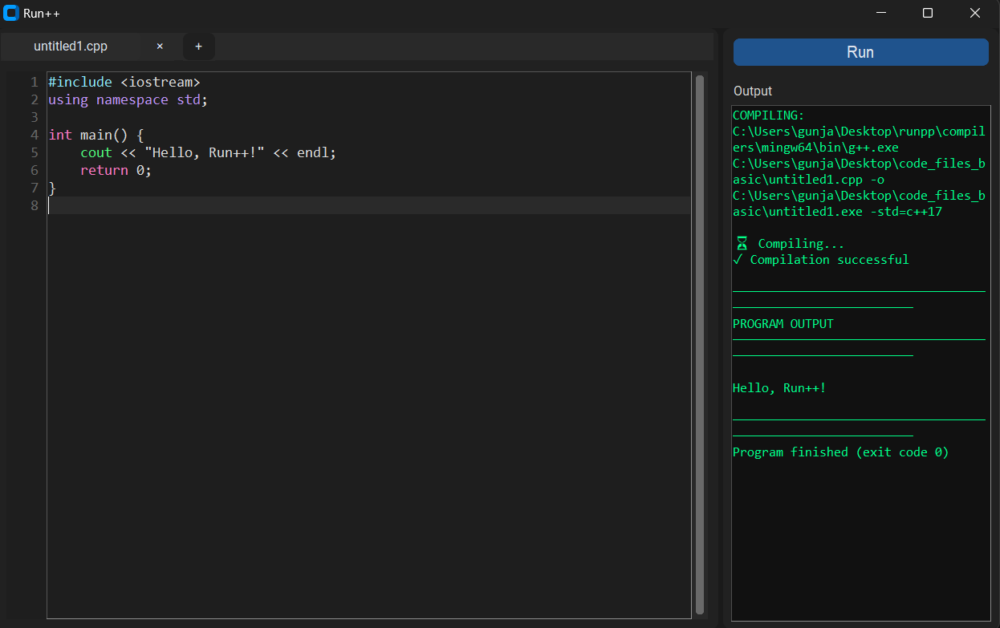
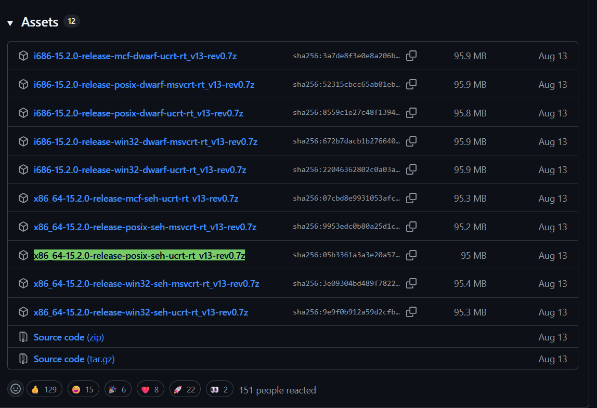

<p align="center">
  
</p>

<h1 align="center">Run++</h1>

<p align="center">
  <strong>A lightweight C++ editor and runner built with Python</strong><br>
  Fast • Minimal • Focused on learning and experimentation
</p>

<p align="center">
  
  
  
</p>

---

## ✨ Features

- **🧠 Tab-based editing** — Work on multiple C++ files simultaneously
- **🎨 JSON-based syntax highlighting** — Customize colors without touching code
- **📏 Current-line highlighting** — Never lose your place
- **⚡ One-click compile & run** — Instant feedback on your code
- **🖥️ Dual execution modes** — Built-in output panel or external terminal
- **⌨️ Full keyboard shortcuts** — Navigate and edit efficiently
- **🧩 Custom fonts** — Use system fonts or load your own
- **⚙️ Live settings preview** — Changes apply instantly
- **💾 Auto-save support** — Never lose your work
- **🧪 Interactive program support** — Handles `cin`, `getline`, and user input gracefully

---

## 📸 Screenshots

<table>
  <tr>
    <td><br><sub><b>Main Editor</b></sub></td>
    <td><br><sub><b>Settings Window</b></sub></td>
  </tr>
  <tr>
    <td colspan="2"><br><sub><b>Running Code</b></sub></td>
  </tr>
</table>

---

## 🚀 Quick Start

### Prerequisites

- **Python 3.9+**
- **Windows** (external terminal uses CMD)
- **MinGW-w64** compiler (see [Compiler Setup](#%EF%B8%8F-compiler-setup))

### Installation

1. **Clone the repository**
   ```bash
   git clone https://github.com/yourusername/runpp.git
   cd runpp
   ```

2. **Install dependencies**
   ```bash
   pip install customtkinter fonttools
   ```

3. **Run Run++**
   ```bash
   python runpp.py
   ```

---

## ⚙️ Compiler Setup

### Important Notice

The compiler included in this repository is a **temporary placeholder** and may not function correctly. For the best experience:

- **Official releases** will include a bundled compiler
- **Development builds** require you to download and configure your own compiler

### Recommended Compiler (Tested)

Download from: [MinGW Builds by niXman](https://github.com/niXman/mingw-builds-binaries/releases)

**Exact build tested:**
```
x86_64-15.2.0-release-posix-seh-ucrt-rt_v13-rev0.7z
```

**Exact build screenshots**
<p align="center">
  
</p>

### Folder Structure

After downloading, extract and organize as follows:

```
runpp/
└── compilers/
    └── mingw64/
        └── bin/
            └── g++.exe
```

Run++ will automatically detect the compiler in this location.

---

## ⌨️ Keyboard Shortcuts

| Shortcut | Action |
|----------|--------|
| `Ctrl + S` | Save current file |
| `Ctrl + O` | Open file |
| `Ctrl + T` | New tab |
| `Ctrl + W` | Close current tab |
| `Ctrl + Shift + S` | Open Settings |

> Note: Only tab management has GUI buttons. Save, Open, and Settings are keyboard-only.

---

## 🎨 Syntax Highlighting

Run++ uses **simple JSON files** for syntax highlighting, making customization incredibly easy.

### File Location

All syntax themes are stored in:
```
Hsyntax/
```

### Customizing Themes

You can:
- Edit `default.json` directly
- Duplicate and rename it to create new themes
- Add custom keywords without writing any code

### Example Syntax File

```json
{
  "name": "default",
  "int": "#ff79c6",
  "float": "#ff79c6",
  "double": "#ff79c6",
  "char": "#ff79c6",
  "void": "#ff79c6",
  "if": "#ff79c6",
  "else": "#ff79c6",
  "for": "#ff79c6",
  "while": "#ff79c6",
  "switch": "#ff79c6",
  "case": "#ff79c6",
  "return": "#ff79c6",
  "#include": "#8be9fd",
  "cout": "#50fa7b",
  "cin": "#50fa7b",
  "using": "#bd93f9",
  "namespace": "#bd93f9",
  "std": "#bd93f9"
}
```

### Adding Custom Keywords

Simply add any word you want highlighted:

```json
{
  "myCustomFunction": "#f1fa8c",
  "TODO": "#ff5555"
}
```

**Rules:**
- All words are matched are matched literally
- Colors use standard hex format (`#RRGGBB`)
- Planning on adding group syntax next

---

## 🖥️ Execution Modes

### Built-in Output Panel
- Best for simple programs
- Output appears directly in the editor
- Fast and convenient
- Can not handle programs that take input and will automatically switch to 'External Terminal Mode'

### External Terminal Mode
- **Required for interactive programs** (using `cin`, `getline`, etc.)
- Runs in a new CMD window
- Prevents UI freezing and input issues
- Familiar behavior from classic IDEs (Dev-C++, Code::Blocks)

> Run++ automatically handles program execution to prevent common issues with standard input.

---

## 📂 Project Structure

```
runpp/
├── runpp.py              # Main application entry point
├── Hsyntax/               # Syntax highlighting themes
│   └── default.json
├── compilers/            # Compiler binaries (user-provided)
│   └── mingw64/
├── for_readme/           # Documentation assets
│   ├── icon.png
│   ├── editor.png
│   ├── settings.png
│   └── run.png
└── README.md
```

---

## 🚧 Development Status

Run++ is an **educational and experimental project** designed for:

- Learning C++ fundamentals
- Quick code testing and prototyping
- Understanding how IDEs work internally

**Note:** This is not intended to replace full-featured IDEs like Visual Studio or CLion. Breaking changes may occur as the project evolves.

---

## 🤝 Contributing

Contributions are welcome! Whether it's:

- Bug reports
- Feature suggestions
- Code improvements
- Documentation updates

Feel free to open an issue or submit a pull request.

---

## 📜 License

This project is licensed under the **GNU General Public License v3.0 (GPL-3.0)**.

See the [LICENSE](LICENSE) file for full details.

---

## 🙌 Credits

- **UI Framework:** [CustomTkinter](https://github.com/TomSchimansky/CustomTkinter)
- **Compiler:** [MinGW-w64](https://www.mingw-w64.org/)
- **Inspiration:** Lightweight C++ IDEs like Dev-C++ and Code::Blocks

---

<p align="center">
  Made with ❤️ for learners and experimenters
</p>

<p align="center">
  <a href="#top">Back to top ↑</a>
</p>
